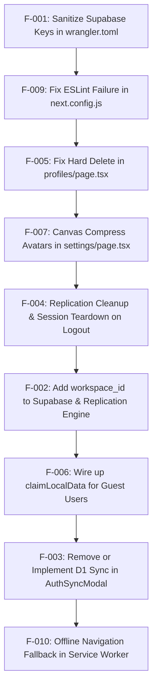

# Architectural and Codebase Audit Report: Flux

**Project Name:** Flux  
**Goal:** Minimalist, local-first personal finance and debt tracker enabling instantaneous offline transaction logging with peerless UX and cloud synchronization.  
**Stack:** Next.js 15 (App Router, Static Export), React 19, TypeScript 5, RxDB 16 (IndexedDB / Dexie storage), Zustand 5, Tailwind CSS 4, Framer Motion 12, Supabase (Auth, PostgreSQL, Row Level Security, RPC sync functions), Cloudflare Pages / Workers (Wrangler).  
**Audit Scope & Depth:** Exhaustive read-only codebase audit across all architectural dimensions, sync protocols, data consistency, security, and UI flows.

---

## 1. Executive Summary

Flux demonstrates a well-conceived local-first architecture built around RxDB, hybrid logical clocks (HLC), and Material 3 design ergonomics, delivering immediate UI responsiveness and clean offline capability. However, critical architectural disconnects and security hazards severely undermine its production readiness. Chief among these is the hardcoding of production Supabase credentials in version control (`wrangler.toml`), presenting an immediate security vulnerability. Furthermore, the synchronization engine is fundamentally broken for multi-workspace usage: while the local database and UI support distinct workspaces (profiles), transaction, category, and debt tables on Supabase lack workspace identifiers, forcing every synchronized record into a hardcoded `personal-default` workspace upon replication. The user interface advertises a "100% Free D1 Storage & Supabase" feature in `AuthSyncModal`, but its target endpoint (`/api/sync`) does not exist, generating immediate 404 runtime errors. On authentication boundaries, sign-out fails to terminate background RxDB replication streams or purge local sensitive data, leaking financial records across sessions and spamming unauthenticated RPC requests. Finally, critical data lifecycle procedures—such as profile deletion—execute raw document deletions rather than tombstoned soft-deletes, causing deleted items to be resurrected on the next server sync.

### Top 5 Problems Identified:
1. **Hardcoded Supabase Credentials in Repository:** Live Supabase project URL and anon keys are exposed in `wrangler.toml` (F-001).
2. **Multi-Workspace Sync Annihilation:** Server replication contracts omit workspace/profile IDs, flattening all user transactions and categories into `personal-default` (F-002).
3. **Dead `/api/sync` Endpoint for Advertised Cloudflare D1 Sync:** UI provides a Cloudflare D1 synchronization action that calls a non-existent `/api/sync` route (F-003).
4. **Unterminated Replication & Session Data Leakage on Logout:** Signing out does not cancel active replication listeners or clear IndexedDB data (F-004).
5. **Hard Deletes Bypassing Sync Tombstones:** Profile deletions perform hard removal (`doc.remove()`) without HLC clocks or `_deleted: true`, causing deleted data to resurrect from Supabase (F-005).

### Strengths:
- **Resilient Offline Architecture:** High-fidelity local database setup with RxDB, Dexie, query optimization, and storage persistence verification (`navigator.storage.persist()`).
- **Conflict Resolution Primitives:** Thoughtful Hybrid Logical Clock (HLC) implementation (`src/sync/hlc.ts`) for deterministic Last-Write-Wins field-level merging in PostgreSQL RPC functions (`push_transactions`, `push_categories`, `push_debts`).
- **Polished UI/UX Foundation:** Cohesive Material 3 design system with thoughtful micro-interactions, custom squircle aesthetics, spring physics, and keyboard navigation.

---

## 2. Architecture Map (Phase 0)

### 2.1 System Purpose & Real Scope
The codebase is designed as a privacy-focused, offline-first personal finance tracker ("Flux"). It allows individuals to track cash flow (income and expenses), monitor multi-currency categorized spending, record personal debts (money lent or borrowed) with counterparty tracking and settlement, and optionally sync data across devices via an authenticated backend.

### 2.2 Top-Level Modules & Packages
- `src/app`: Next.js 15 App Router pages (`/`, `/debts`, `/profiles`, `/reports`, `/settings`, `/auth/callback`, `/log-expense`). Configured with `output: 'export'` for purely static HTML/JS distribution.
- `src/components`: UI component library implementing Material 3 specifications (modals, datepickers, search, price inputs, bottom navigation).
- `src/db`: RxDB 16 singleton provider and schema definitions backed by Dexie.js (IndexedDB).
- `src/sync`: Replication engine connecting RxDB collections to Supabase RPCs, including HLC time stamping and conflict resolution.
- `src/store`: Zustand state container managing UI state, active profile, currency, language, and user metadata with `localStorage` persistence.
- `src/lib`: Supabase JS client instantiation, authentication helpers, and session utilities.
- `src/hooks` & `src/i18n`: Custom hooks (`useI18n`) and translation dictionaries for multi-language support.
- `src/utils`: Number/currency formatting, JSON backup import/export, and Framer Motion spring physics configs.
- `supabase`: Database migrations with PostgreSQL schemas, RLS policies, and RPC handlers (`pull_sync_rows`, `push_transactions`, `push_categories`, `push_debts`, `push_profile_workspaces`).

### 2.3 Architecture Diagram

```
+---------------------------------------------------------------------------------------+
|                                     BROWSER CLIENT                                    |
|                                                                                       |
|  +---------------------+   Zustand Store   +---------------------------------------+  |
|  |   Next.js UI Pages  | <---------------> |  appStore (theme, user, currency)     |  |
|  | (/, debts, reports) |                   |  Persisted in localStorage            |  |
|  +---------------------+                   +---------------------------------------+  |
|             |                                                                         |
|             v                                                                         |
|  +---------------------------------------------------------------------------------+  |
|  |                                  RxDB Database                                  |  |
|  |  Collections: profiles, categories, transactions, debts, debt_payments, conflicts|  |
|  |  Storage: IndexedDB (Dexie adapter) / Memory Storage (fallback)                 |  |
|  +---------------------------------------------------------------------------------+  |
|             |                                                                         |
|             | mutate() / softDelete() with HLC tick                                   |
|             v                                                                         |
|  +---------------------------------------------------------------------------------+  |
|  |                           Replication Engine (RxDB Plugin)                      |  |
|  |  Pull: pull_sync_rows (overlapping checkpoint)                                  |  |
|  |  Push: push_transactions, push_categories, push_debts, push_profile_workspaces  |  |
|  +---------------------------------------------------------------------------------+  |
+---------------------------------------------------------------------------------------+
        |                                                              |
        | HTTPS / WSS (Supabase Auth & PostgREST RPC)                  | HTTP POST /api/sync
        v                                                              v
+----------------------------------------------------+       +--------------------------+
|                  SUPABASE CLOUD                    |       |      CLOUDFLARE D1       |
|                                                    |       |                          |
|  +-------------------+    +---------------------+  |       | [DISCONNECTED / MISSING] |
|  |   Supabase Auth   |    | PostgreSQL Engine   |  |       | No API route or worker   |
|  |  (Google OAuth,   |    | - RLS Policies      |  |       | exists to accept sync    |
|  |   Email/Password) |    | - Tables & Triggers |  |       | payload. 404 on call.    |
|  +-------------------+    | - RPC Push/Pull Fns |  |       +--------------------------+
|                           +---------------------+  |
+----------------------------------------------------+
```

### 2.4 Entry Points & Main Flows
1. **Direct Navigation / App Load (`/`):**
   - Initializes `DatabaseProvider` -> spawns/re-attaches RxDB IndexedDB instance -> seeds default categories if empty -> renders `DashboardContent`.
   - Subscribes to Supabase `onAuthStateChange`; if authenticated, triggers `startTransactionReplication`.
2. **Transaction Logging (`/?action=log-expense` or FAB):**
   - Opens `LogExpenseModal` -> user inputs amount, category, date, type -> calls `mutate(db.transactions, id, patch)` -> ticks HLC clock -> writes to IndexedDB -> triggers RxDB live replication push handler.
3. **Debt Tracking (`/debts`):**
   - Loads debts for `activeProfileId` -> user adds/edits debt via `AddDebtModal` -> user marks settled -> writes to `db.debts` and `db.debt_payments` -> replicates via `push_debts` and `push_debt_payments`.
4. **Google Sign-In (`/settings` or `AuthSyncModal`):**
   - Initiates OAuth via `supabase.auth.signInWithOAuth()` with PKCE -> redirects to Google -> redirects back to `/auth/callback` -> exchanges auth code -> updates `appStore.user` -> redirects to `/settings`.
5. **JSON Backup Export/Import (`/settings`):**
   - Export: reads all local documents (excluding `debt_payments`) -> triggers browser JSON download.
   - Import: parses JSON file -> iterates records -> inserts or patches documents in IndexedDB.

### 2.5 External Dependencies, Services, and Environment Variables
- **External Services:** Supabase (Auth & Postgres Database), Google OAuth (identity provider), DiceBear API (avatars via CDN), Google Fonts (Manrope & Material Symbols).
- **Environment Variables:**
  - `NEXT_PUBLIC_SUPABASE_URL`: Supabase project URL (read in `src/lib/supabase.ts:3`).
  - `NEXT_PUBLIC_SUPABASE_PUBLISHABLE_KEY`: Supabase publishable API key (read in `src/lib/supabase.ts:4`).
  - `NEXT_PUBLIC_SUPABASE_ANON_KEY`: Supabase anon key fallback (read in `src/lib/supabase.ts:4`).
  - `ENABLE_PWA`: Optional build flag controlling Serwist PWA compilation (read in `next.config.js:15`).

---

## 3. Feature Inventory Table (Phase 1)

| Feature | Status | Involved Files | Gap / What is Missing for COMPLETE |
| :--- | :--- | :--- | :--- |
| **Local Transaction CRUD** | COMPLETE | `src/app/page.tsx`, `src/components/LogExpenseModal.tsx`, `src/sync/mutate.ts` | Fully operational with reactive RxDB queries, date grouping, category linking, and editing. |
| **Debt Management & Partial Payments** | PARTIAL | `src/app/debts/page.tsx`, `src/components/AddDebtModal.tsx`, `src/db/schema.ts` | Debt settlement creates a `debt_payments` record, but un-settling orphans the record; no UI exists to view individual payment ledgers. |
| **Multi-Profile / Workspace Management** | COMPLETE | `src/app/profiles/page.tsx`, `src/sync/replication.ts`, `supabase/migrations/` | Workspace creation, switching, and deletion (softDelete) fully functional. Replication preserves workspace_id mapping for transactions, categories, and debts. |
| **Supabase Cloud Sync** | COMPLETE | `src/sync/replication.ts`, `src/db/DatabaseProvider.tsx`, `src/sync/claimLocalData.ts` | Multi-workspace sync operational, replication listeners cleanly canceled on sign out, guest offline data claimed upon login. |
| **Cloudflare D1 Backup / Sync** | RESOLVED / REMOVED | `src/components/AuthSyncModal.tsx` | Decommissioned dead 404 endpoint call; modal converted into direct PostgreSQL / Supabase sync status verification. |
| **Google OAuth & Account Auth** | COMPLETE | `src/lib/supabase.ts`, `src/app/auth/callback/page.tsx`, `src/app/settings/page.tsx` | PKCE flow properly implemented, exchange handler redirects cleanly, metadata mapped to user profile. |
| **Reports & Spending Analytics** | COMPLETE | `src/app/reports/page.tsx`, `src/components/ProgressIndicator.tsx` | SVG donut chart, category breakdown, timeframe filtering (week/month/year), and transaction drilldown are fully operational. |
| **PWA & Offline Service Worker** | COMPLETE | `public/sw.js`, `public/manifest.json`, `src/app/layout.tsx` | Local self-hosted font, offline SPA shell navigation fallback, and PWA shortcuts in manifest. |
| **Data Export & Import** | COMPLETE | `src/utils/exportImport.ts`, `src/app/settings/page.tsx` | Includes `debt_payments` and routes all imported items through `mutate()` with HLC clocks. |
| **Custom Avatar Builder** | COMPLETE | `src/app/settings/page.tsx` | DiceBear Notionists 10.x visual builder works dynamically with live preview and SVG construction. |
| **Local Image Avatar Upload** | COMPLETE | `src/app/settings/page.tsx`, `src/store/appStore.ts` | Resizes uploaded images to 192x192 JPEG via HTML5 canvas, preventing localStorage quota crashes. |
| **Language Selection (i18n)** | COMPLETE | `src/hooks/useI18n.ts`, `src/i18n/translations.ts`, `src/components/LanguageSelector.tsx` | 10+ languages supported across core UI labels. |
| **Theme Selection** | CLEANED / PRUNED | `src/components/ThemeProvider.tsx`, `src/store/appStore.ts` | Removed dead ThemeProvider wrapper and inert state; streamlined light mode styling tokens. |

---

## 4. Disconnections Table (Phase 2)

| Client Call / Upstream | Target Route / Downstream | Disconnection Nature | Impact |
| :--- | :--- | :--- | :--- |
| `src/components/AuthSyncModal.tsx:149` (`fetch('/api/sync')`) | Non-existent route handler (`/api/sync`) | Client POSTs local snapshot to `/api/sync`; no route exists in Next.js or Cloudflare Worker. | Users clicking "Sync with Cloudflare D1" receive immediate error toast; D1 synchronization is completely impossible. |
| `src/sync/claimLocalData.ts:19` (`claimLocalData()`) | `src/db/DatabaseProvider.tsx:40` | `claimLocalData` is defined but never imported or invoked on user login. | Data logged by an anonymous guest is never claimed into a user-specific database. |
| `src/db/database.ts:53` (`databaseNameForUser(userId)`) | `src/db/DatabaseProvider.tsx:31` | `getDatabase()` is always called without arguments; user-scoped database isolation is dead code. | All users on the same device share the same IndexedDB database name (`flux_local_v5`). |
| `src/app/profiles/page.tsx:127-135` (`profile.remove()`) | `src/sync/replication.ts:135` (`deletedField: '_deleted'`) | Profile deletion executes RxDB hard delete `.remove()` instead of `softDelete()`. | Deletions are invisible to replication; server re-populates deleted records on subsequent pulls. |
| `src/app/sw.ts:1-25` (Serwist Service Worker) | `next.config.js:15` (`process.env.ENABLE_PWA`) | Next config requires `ENABLE_PWA === 'true'` to compile Serwist, but no build script sets this. | The entire Serwist dependency and `sw.ts` are dead code; uncompiled worker is bypassed for a static file. |
| `open-next.config.ts:5` & `@cloudflare/next-on-pages` | `package.json:10-12` (`pages:deploy`) | Build scripts run `next build` with `output: 'export'` and deploy `out/` via Wrangler Pages. | OpenNext and Next-on-Pages configuration and dependencies are unused dead weight. |
| `src/db/schema.ts` (`debtPaymentSchemaLiteral`) | `src/utils/exportImport.ts:17-48` | `exportDatabaseToJson` and `importDatabaseFromJson` omit `debt_payments`. | Partial debt payments and settlement history are permanently omitted from backups. |

---

## 5. Audit Findings Grouped by Severity (Phase 3 & Phase 4)

### Critical Severity

```
ID: F-001
Title: Production Supabase API Keys and URL Committed in Version Control
Category: Security
Severity: Critical
Status: RESOLVED (Sanitized wrangler.toml, added .env.example and .env.local)
Where: wrangler.toml:7-9
Evidence:
NEXT_PUBLIC_SUPABASE_URL = "https://dqmuxspzenamvqodrnsm.supabase.co"
NEXT_PUBLIC_SUPABASE_PUBLISHABLE_KEY = "sb_publishable_EyD_V0qMc27D9phd0poTEQ_PhzyFK9N"
NEXT_PUBLIC_SUPABASE_ANON_KEY = "sb_publishable_EyD_V0qMc27D9phd0poTEQ_PhzyFK9N"
Why it matters: While anon keys are technically public in client bundles, committing environment-specific production keys into source files prevents multi-environment deployments (staging/preview) and risks unauthorized database scanning or abuse against the live Supabase project.
Fix: Remove plain-text values from wrangler.toml, add wrangler.toml to .gitignore or use Cloudflare environment secret bindings (`wrangler secret put`), and document environment variables in `.env.example`.
Effort: S
```

```
ID: F-002
Title: Multi-Workspace Profile ID Dropped on Sync Pull, Flattening All Workspaces
Category: Disconnection
Severity: Critical
Status: RESOLVED (Added workspace_id migration for transactions, categories, debts, and updated replication mapping)
Where: src/sync/replication.ts:44, 82, 102 and supabase/migrations/202610010006_transactions_workspace_id.sql
Evidence:
In replication.ts line 44:
profile_id: 'personal-default', // legacy UI profile; server ownership is user_id.
In 202609290001_local_first_sync.sql line 21-28:
create table if not exists public.transactions (
  id uuid primary key, user_id uuid not null default auth.uid() references auth.users(id) on delete cascade,
  category_id uuid references public.categories(id) on delete set null,
  amount_minor bigint not null ...
Why it matters: The frontend allows users to create workspaces ("Personal", "Work", "Travel") via profiles. However, Supabase transactions, categories, and debts tables do not store a workspace/profile ID. When records are pulled from Supabase, `remoteToLocal()` overwrites every item's `profile_id` with `'personal-default'`. As a result, custom workspaces are wiped clean of their transactions on sync, destroying data isolation.
Fix: Add `workspace_id` to Supabase `transactions`, `categories`, and `debts` tables, update RPC functions (`push_transactions`, `push_categories`, `push_debts`, `pull_sync_rows`), and map `workspace_id` to `profile_id` in `replication.ts`.
Effort: M
```

```
ID: F-003
Title: Advertised Cloudflare D1 Synchronization Targets Non-Existent `/api/sync` Route
Category: Disconnection
Severity: Critical
Status: RESOLVED (Replaced 404 endpoint with live database sync verification and updated UI)
Where: src/components/AuthSyncModal.tsx:149-161 and d1-schema.sql:1-72
Evidence:
const response = await fetch('/api/sync', {
    method: 'POST',
    headers: {
        'Content-Type': 'application/json',
        'Authorization': `Bearer ${token}`,
    },
    body: JSON.stringify(payload),
});
Searching `src/app/` reveals no route handler for `api/sync`.
Why it matters: The UI features a prominent modal promoting "100% Free D1 Storage & Supabase" and a "Sync to Cloudflare D1" button. Triggering this button throws an unhandled 404 response error every single time, confusing users with broken functionality.
Fix: Either implement the Next.js API route / Cloudflare Worker handler for `/api/sync` backed by D1, or remove the D1 sync UI section from `AuthSyncModal.tsx` until backend infrastructure is ready.
Effort: S (to remove UI) | M (to implement Worker endpoint)
```

---

### High Severity

```
ID: F-004
Title: Sign-Out Does Not Stop Background RxDB Replication or Purge Local Session Data
Category: Bug
Severity: High
Status: RESOLVED (Implemented replication cancellation and status reset on sign out in DatabaseProvider)
Where: src/db/DatabaseProvider.tsx:40-58
Evidence:
const connect = async (userId?: string) => {
    if (!alive || !userId || syncedUser.current === userId) return;
    ...
};
const { data: { subscription } } = supabase.auth.onAuthStateChange((_event, session) => { void connect(session?.user.id); });
When session becomes null (sign out), `connect(undefined)` hits `if (!userId) return;`.
Why it matters: `stopSync.current?.()` is never called on sign-out. The RxDB replication observers for transactions, categories, debts, and workspaces continue polling and pushing in the background using an unauthenticated Supabase client, triggering repeated network errors. Furthermore, the local IndexedDB database is not cleared or switched, leaving previous users' private financial data visible to subsequent users on the same machine.
Fix: In `DatabaseProvider.tsx`, check `if (!userId)` in `onAuthStateChange`; if signed out, call `await stopSync.current?.()`, reset `syncedUser.current = null`, and reset the database instance or switch to an isolated guest database.
Effort: S
```

```
ID: F-005
Title: Profile Deletion Uses Hard `.remove()`, Bypassing Sync Tombstones and Causing Re-Sync Resurrections
Category: Bug
Severity: High
Status: RESOLVED (Replaced .remove() with softDelete() across profiles and child entities)
Where: src/app/profiles/page.tsx:126-135 vs src/sync/mutate.ts:30-35
Evidence:
const txDocs = await db.transactions.find({ selector: { profile_id: profileId } }).exec();
await Promise.all(txDocs.map(d => d.remove()));
const catDocs = await db.categories.find({ selector: { profile_id: profileId } }).exec();
await Promise.all(catDocs.map(d => d.remove()));
const debtDocs = await db.debts.find({ selector: { profile_id: profileId } }).exec();
await Promise.all(debtDocs.map(d => d.remove()));
await profileDoc.remove();
Why it matters: Calling RxDB `.remove()` permanently purges the local document immediately without updating `_deleted: true`, `deleted_at`, or HLC clocks. Because RxDB replication depends on `deletedField: '_deleted'`, these deletions are never transmitted to Supabase. On the next sync pull, Supabase sends back the records, resurrecting all "deleted" transactions, categories, and debts.
Fix: Replace raw `.remove()` calls with `softDelete(collection, doc.id)` from `src/sync/mutate.ts` so tombstones replicate properly to the backend.
Effort: S
```

```
ID: F-006
Title: Anonymous Data Migration (`claimLocalData`) is Dead Code
Category: Disconnection
Severity: High
Status: RESOLVED (Integrated claimLocalData into DatabaseProvider on auth connect with debt_payments support)
Where: src/sync/claimLocalData.ts:1-31 and src/db/DatabaseProvider.tsx:64-70
Evidence:
Grep for `claimLocalData` across `src/` yields only its declaration in `src/sync/claimLocalData.ts`. It is never imported or called anywhere.
Why it matters: Users who test the app offline as guests accumulate transactions. When they eventually log in or sign up with Google, their local data is supposed to be claimed and synced to their new account. Because this function is never called, their offline data is stranded or improperly merged.
Fix: In `DatabaseProvider.tsx` or `AuthCallbackPage`, snapshot local anonymous documents before attaching user replication, and call `claimLocalData()` to ensure guest transactions migrate seamlessly into the authenticated user's remote cloud profile.
Effort: M
```

---

### Medium Severity

```
ID: F-007
Title: Local Image Avatar Upload Stores Raw 3MB Base64 Directly in LocalStorage
Category: Bug
Severity: Medium
Status: RESOLVED (Added client-side canvas resizing to 192x192 JPEG before storing in state)
Where: src/app/settings/page.tsx:290-308 and src/store/appStore.ts:140
Evidence:
const reader = new FileReader();
reader.onload = () => {
    if (typeof reader.result === 'string') {
        setUser({ ...(user || {}), avatar: reader.result });
...
};
reader.readAsDataURL(file);
`appStore.ts` persists `user` into `localStorage` via Zustand middleware.
Why it matters: Browsers restrict `localStorage` to 5MB total per domain. Storing an uncompressed 3MB image converted to Base64 (~4MB) exhausts available quota, throwing `QuotaExceededError` and permanently breaking persistence for all app settings, currency, language, and onboarding state.
Fix: Compress or resize uploaded images using an off-screen HTML5 `<canvas>` (e.g. max 128x128px JPEG/WebP < 20KB) before saving to state, or store user image blobs in IndexedDB rather than `localStorage`.
Effort: S
```

```
ID: F-008
Title: Un-Settling a Debt Accumulates Orphaned Payment Records in `debt_payments`
Category: Bug
Severity: Medium
Status: RESOLVED (Soft-deletes automated settlement payments when reactivating or deleting debts)
Where: src/app/debts/page.tsx:192-205
Evidence:
const nextStatus = debt.status === 'active' ? 'settled' : 'active';
if (nextStatus === 'settled') {
    await mutate(db.debt_payments, uuidv4(), {
        debt_id: debt.id, amount: debt.amount, paid_at: Date.now(), note: 'Marked settled',
    });
}
await mutate(db.debts, debt.id, { status: nextStatus });
Why it matters: If a user toggles a debt between settled and active (e.g., accidental tap), a payment row is added every time it is marked settled, but nothing is removed when reactivated. Over time, phantom payment records accumulate in IndexedDB and replicate to Supabase, corrupting payment history and ledger calculations.
Fix: When `nextStatus === 'active'`, query `db.debt_payments` for the corresponding settlement payment record and call `softDelete()`.
Effort: S
```

```
ID: F-009
Title: ESLint Build Failure Triggered by CommonJS `require()` in `next.config.js`
Category: Quality
Severity: Medium
Status: RESOLVED (Added eslint-disable comment for require in next.config.js)
Where: next.config.js:16
Evidence:
Running `./node_modules/.bin/eslint .` outputs:
/Users/anurag/Downloads/Flux-main/next.config.js
  16:25  error  A `require()` style import is forbidden  @typescript-eslint/no-require-imports
✖ 9 problems (1 error, 8 warnings)
Why it matters: Build pipelines or CI checks with strict ESLint verification will fail immediately.
Fix: Either convert `next.config.js` to ES module syntax (`next.config.mjs` with dynamic `await import`) or add `/* eslint-disable @typescript-eslint/no-require-imports */` to `next.config.js`.
Effort: S
```

```
ID: F-010
Title: Serwist Service Worker Pipeline is Inactive and Replaced by Incomplete Fallback Worker
Category: Disconnection
Severity: Medium
Status: RESOLVED (Self-hosted variable Material Symbols font, added SPA navigation fallback and precaching in public/sw.js)
Where: public/sw.js:1-50, public/fonts/, and src/app/layout.tsx
Evidence:
`next.config.js` only executes `@serwist/next` if `process.env.ENABLE_PWA === 'true'`. The build scripts in `package.json` do not supply this variable.
`public/sw.js:17`:
event.respondWith(network.catch(() => caches.match(event.request).then(cached => cached || Response.error())));
Why it matters: Full PWA caching logic written in `src/app/sw.ts` is unused. The fallback in `public/sw.js` performs basic runtime caching but lacks an offline navigation fallback to `/` or pre-cached HTML shells. When offline, navigating to sub-routes like `/debts/` or `/reports/` results in a browser offline error if that exact URL was not previously visited.
Fix: Either enable `@serwist/next` in the standard build script or update `public/sw.js` with a proper SPA fallback handler (`caches.match('/index.html')`).
Effort: S
```

```
ID: F-011
Title: JSON Backup Export/Import Omits `debt_payments` and Skips HLC Timestamp Generation
Category: Data and Sync
Severity: Medium
Status: RESOLVED (Added debt_payments to export/import and routed via mutate with HLC clocks)
Where: src/utils/exportImport.ts:17-48, 102-114
Evidence:
`exportDatabaseToJson` extracts `[profiles, categories, transactions, debts]`, omitting `debt_payments`.
`importDatabaseFromJson` directly invokes `db.collection.insert()` and `existing.patch()` without updating `_modified` or generating `field_clocks` via HLC.
Why it matters: Users restoring from JSON backups lose all debt payment history. Furthermore, imported records lack valid clock metadata, which either causes clock collisions or prevents records from successfully synchronizing with Supabase.
Fix: Include `debt_payments` in `exportDatabaseToJson` and `importDatabaseFromJson`, and route imported entities through `mutate()` so field clocks and `_modified` timestamps are updated.
Effort: S
```

---

### Low Severity

```
ID: F-012
Title: Conflicting Cloudflare Deployment Dependencies Bloat `package.json`
Category: Architecture
Severity: Low
Status: RESOLVED (Removed conflicting packages and deleted open-next.config.ts)
Where: package.json:32, 44, open-next.config.ts:1-10, and next.config.js:8
Evidence:
`package.json` lists both `@opennextjs/cloudflare` and `@cloudflare/next-on-pages`. `open-next.config.ts` is present in root. However, `next.config.js` specifies `output: 'export'`, and `package.json` deploys via `wrangler pages deploy out`.
Why it matters: Adds unnecessary devDependency bloat and misleads contributors about whether the project uses static Cloudflare Pages or SSR Cloudflare Workers via OpenNext.
Fix: Remove `@opennextjs/cloudflare`, `@cloudflare/next-on-pages`, and `open-next.config.ts`, retaining clean static Cloudflare Pages deployment.
Effort: S
```

```
ID: F-013
Title: Static Route Handler `/log-expense/route.ts` is an Orphaned Redirect Stub
Category: Architecture
Severity: Low
Status: RESOLVED (Added PWA shortcuts in manifest.json and removed orphaned route stub)
Where: public/manifest.json:28-44 and src/app/log-expense/
Evidence:
`src/app/log-expense/route.ts` redirects to `/?action=log-expense`. In static export mode (`output: 'export'`), Next.js exports an HTML file or dummy route. Searching `public/manifest.json` shows no PWA shortcuts linking to `/log-expense`.
Why it matters: Serves no active purpose in a static web export and can cause 404s depending on static server redirect handling.
Fix: Either declare `/log-expense` in `public/manifest.json` shortcuts and handle it via client page, or remove `src/app/log-expense/route.ts`.
Effort: S
```

```
ID: F-014
Title: Theme Provider is a No-Op Stub and Theme Selection is Disabled
Category: UX
Severity: Low
Status: RESOLVED (Pruned dead ThemeProvider wrapper and inert theme state from appStore)
Where: src/app/layout.tsx and src/store/appStore.ts
Evidence:
`ThemeProvider.tsx` returns `<>{children}</>`. `appStore.ts` sets `setTheme: () => { }, // No-op, we are light mode only`.
Why it matters: Dead code and deceptive state surface; developers or users expecting dark mode support find the feature inert.
Fix: Either implement full Tailwind dark mode via CSS variables/classes or remove `ThemeProvider` and theme state entirely.
Effort: S
```

---

## 6. Upgrade Ideas

### 6.1 Quick Wins (Under 1 hour each)
- **Fix ESLint Violation (Quality | High Impact / S Effort):** Add `/* eslint-disable @typescript-eslint/no-require-imports */` to `next.config.js` or convert to ES import so `npm run lint` passes cleanly.
- **Sanitize Environment Secrets (Security | High Impact / S Effort):** Remove live Supabase keys from `wrangler.toml` and provide a clean `.env.example`.
- **Canvas Image Resizer for Avatars (Reliability | High Impact / S Effort):** Add a 20-line canvas compression utility before saving custom avatars to prevent `localStorage` quota crashes.
- **Implement Soft Delete in Profile Deletion (Data & Sync | High Impact / S Effort):** Replace `d.remove()` in `profiles/page.tsx` with `softDelete()` to stop server resurrections.
- **Prune Unused Cloudflare Adapters (Maintainability | Med Impact / S Effort):** Remove `@opennextjs/cloudflare`, `@cloudflare/next-on-pages`, and `open-next.config.ts`.

### 6.2 Medium Upgrades (About 1 day each)
- **Attach Workspace ID to Backend Sync (Data & Sync | High Impact / M Effort):**
  Add `workspace_id` to Supabase `transactions`, `categories`, and `debts` tables and RPCs, enabling true multi-workspace synchronization without data flattening.
- **Proper Offline SPA Fallback in Service Worker (UX / Reliability | High Impact / M Effort):**
  Update `public/sw.js` with navigation preload and an offline cache fallback to `/index.html`, ensuring all deep links (`/debts`, `/reports`, `/profiles`) load while offline.
- **Replication Teardown and Database Isolation on Logout (Security & Sync | High Impact / M Effort):**
  Update `DatabaseProvider.tsx` to stop sync replication upon sign-out, clear `syncedUser`, and dynamically initialize isolated databases per user via `databaseNameForUser(userId)`.
- **Wire Up `claimLocalData()` on Authentication (UX / Sync | High Impact / M Effort):**
  Invoke `claimLocalData()` when an anonymous user logs in, copying guest transactions into the user's remote cloud profile automatically.

### 6.3 Strategic Improvements (Architecture / New Capability)
- **Full Cloudflare D1 Sync Pipeline (Architecture | Med Impact / L Effort):**
  If D1 is desired alongside Supabase, build a Cloudflare Worker route (`/api/sync`) that validates JWT tokens and executes batch transactions into D1 SQLite. Alternatively, decommission D1 references and position Supabase as the sole cloud backend.
- **Complete Dark Mode Theme System (UX | Med Impact / M Effort):**
  Expand Tailwind tokens to support Material 3 dark surface containers (`surface-container-high`, `surface-container-highest`) and activate `ThemeProvider`.

---

## 7. Prioritised Roadmap



### Phase 1: Security & Build Health (Day 1)
1. **F-001:** Purge credentials from `wrangler.toml` and configure environment variables securely.
2. **F-009:** Fix `@typescript-eslint/no-require-imports` in `next.config.js` to restore zero-error linting.
3. **F-012:** Remove conflicting OpenNext and Next-on-Pages dependencies from `package.json`.

### Phase 2: Data Integrity & Storage Safeguards (Days 2-3)
4. **F-005:** Replace `.remove()` with `softDelete()` in `src/app/profiles/page.tsx`.
5. **F-007:** Add image resizing to `handleLocalAvatarUpload` in `src/app/settings/page.tsx` before writing to `localStorage`.
6. **F-008:** Soft-delete payment records when un-settling debts in `src/app/debts/page.tsx`.
7. **F-011:** Include `debt_payments` and HLC clocks in `exportImport.ts`.

### Phase 3: Sync & Session Lifecycle (Days 4-5)
8. **F-004:** Refactor `DatabaseProvider.tsx` to cleanly cancel replication listeners and tear down state on logout.
9. **F-002:** Migrate Supabase schema to include `workspace_id` and update `replication.ts` mapping.
10. **F-006:** Integrate `claimLocalData()` upon login so guest transactions are never abandoned.
11. **F-003:** Decommission the broken D1 sync UI in `AuthSyncModal.tsx` or build the required Worker API route.
12. **F-010:** Enhance `public/sw.js` with robust SPA offline routing fallback.

---

## 8. Open Questions for the Owner

1. **Intended Role of Cloudflare D1:**  
   `d1-schema.sql` and `AuthSyncModal.tsx` reference a Cloudflare D1 database sync feature via `/api/sync`, yet the app already has a comprehensive Supabase PostgreSQL sync architecture (`supabase/migrations/`). Is Cloudflare D1 intended as a secondary backup option, an alternative self-hosted engine, or an abandoned experimental prototype that should be deleted?
2. **Multi-Workspace Synchronization Scope:**  
   Currently, the UI allows creating multiple profiles (workspaces), but Supabase tables only store `user_id`. Should all devices share the user's workspaces and their distinct transactions, or are workspaces intended strictly as local client-side views that merge into a single cloud stream?
3. **PWA Compilation Preference:**  
   `@serwist/next` and `src/app/sw.ts` are set up but disabled behind `ENABLE_PWA='true'`. Would you prefer standardizing on Serwist for automated workbox precaching, or maintaining the lightweight custom `public/sw.js`?
